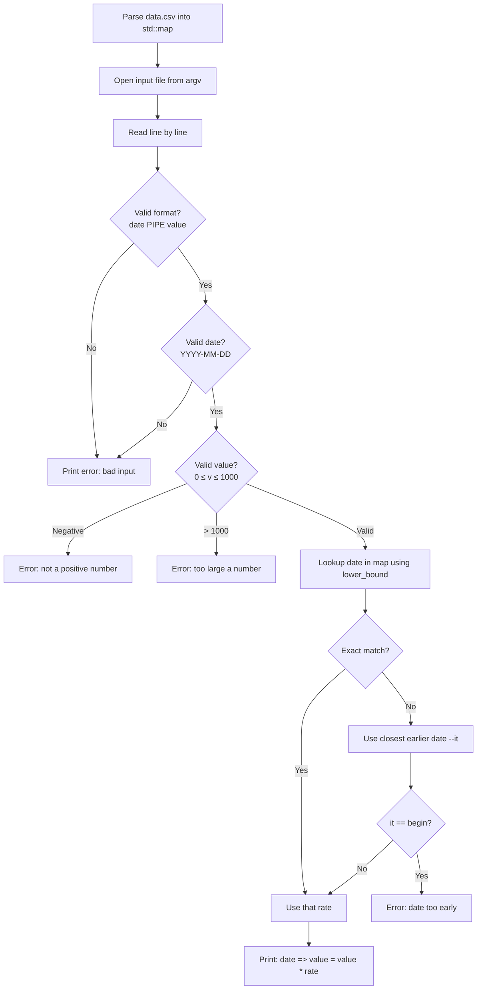
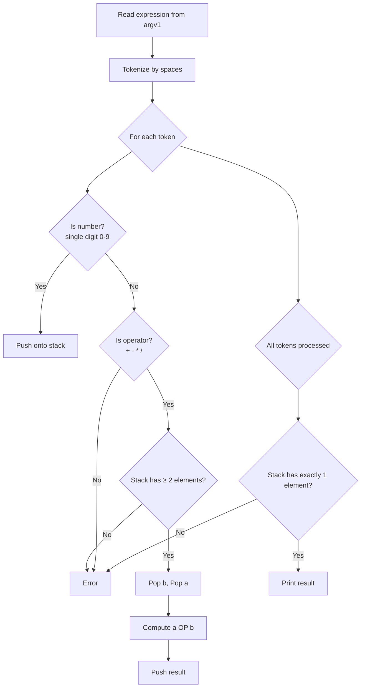
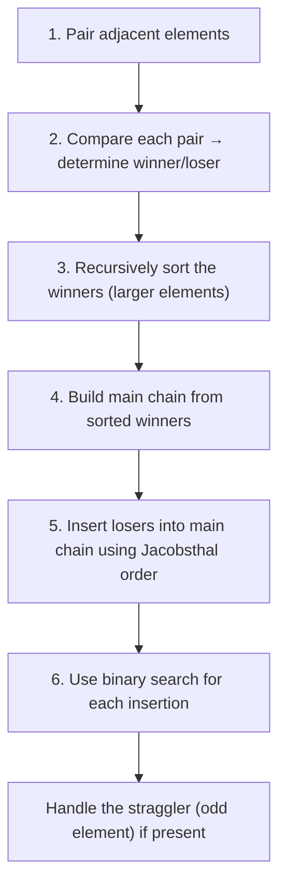

# C++ Module 09 — STL: Analysis & Implementation Plan

## Module Overview

Module 09 is the **final C++ module**, focused entirely on the **STL (Standard Template Library)**. It consists of 3 exercises of increasing difficulty, with a critical constraint: **once a container is used in one exercise, it is forbidden in all subsequent exercises**.

---

## Critical Module Rules

> [!CAUTION]
> **Container Uniqueness Rule**: Each container can only be used **once** across the entire module. Plan your container choices carefully before writing any code.

| Rule | Details |
|------|---------|
| Containers | Must use at least 1 per exercise (2 for ex02) |
| Container reuse | **Forbidden** — once used, it's gone |
| Compilation | `c++ -Wall -Wextra -Werror`, must compile with `-std=c++98` |
| Canonical Form | Orthodox Canonical Form required for all classes |
| Forbidden | `using namespace`, `friend`, `printf`, `alloc`, `free` |
| Headers | Include guards required, no function implementations in headers (except templates) |
| Makefile | `$(NAME)`, `all`, `clean`, `fclean`, `re` — must not relink |

---

## Container Selection Strategy

This is the **most important decision** for the module. Here is the recommended allocation:

| Exercise | Container(s) | Rationale |
|----------|-------------|-----------|
| **ex00** — Bitcoin Exchange | `std::map` | Ordered key-value store with `lower_bound()` for finding the closest earlier date. Perfect fit. |
| **ex01** — RPN | `std::stack` | LIFO data structure, the textbook container for evaluating postfix expressions. |
| **ex02** — PmergeMe | `std::vector` + `std::deque` | Two random-access containers required for Ford-Johnson sort. Both support indexing and efficient insertion patterns. |

> [!IMPORTANT]
> `std::stack` is a **container adaptor** (not a raw container). It internally uses `std::deque` by default. Some evaluators may consider `std::stack` and `std::deque` as different things, others may not. If challenged, argue that `std::stack` is an adaptor, not a container — or switch ex01 to use `std::list` as a stack and then use `std::deque` freely in ex02.

**Fallback strategy**: If an evaluator flags the `stack`/`deque` overlap:
- ex01: use `std::list` (push_back / pop_back as a stack)
- ex02: `std::vector` + `std::deque` (unchanged)

---

## Exercise 00: Bitcoin Exchange (`btc`)

### Goal
Read a CSV database of Bitcoin prices, then process an input file to compute the value of bitcoin amounts on given dates.

### Files
```
ex00/
├── Makefile
├── main.cpp
├── BitcoinExchange.hpp
└── BitcoinExchange.cpp
```

### Algorithm & Design



### Key Implementation Details

1. **Database loading**: Parse `data.csv` (comma-separated, `date,exchange_rate`). Store in `std::map<std::string, float>`. String comparison works for `YYYY-MM-DD` format (lexicographic = chronological).

2. **Input parsing**: Each line must be `"date | value"` (note the spaces around `|`). Skip the header line `"date | value"`.

3. **Date validation**: Check format `YYYY-MM-DD`, validate ranges (month 1–12, day 1–31, handle leap years and month-specific day limits).

4. **Value validation**:
   - Must be a valid number (float or int)
   - Must be ≥ 0 (error: "not a positive number")  
   - Must be ≤ 1000 (error: "too large a number")
   - Note: `2147483648` exceeds INT_MAX → "too large a number"

5. **Date lookup**: Use `std::map::lower_bound(date)`. If the found key != date, decrement the iterator to get the closest earlier date. If iterator is at `begin()` and doesn't match, the date is before all records.

### Error Messages (must match exactly)
```
Error: could not open file.
Error: not a positive number.
Error: too large a number.
Error: bad input => <bad_line>
```

### Output Format
```
2011-01-03 => 3 = 0.9
```

---

## Exercise 01: Reverse Polish Notation (`RPN`)

### Goal
Evaluate a mathematical expression in Reverse Polish Notation (postfix notation).

### Files
```
ex01/
├── Makefile
├── main.cpp
├── RPN.hpp
└── RPN.cpp
```

### Algorithm & Design



### Key Implementation Details

1. **Input**: Single argument string, tokens separated by spaces.

2. **Numbers**: Always less than 10 (single digit: 0–9). The **result** can be any value.

3. **Operators**: `+`, `-`, `*`, `/`. Pop order matters: pop `b` first, then `a`, compute `a OP b`.

4. **Error cases** (print `"Error"` to **stderr**):
   - Brackets present (e.g., `"(1 + 1)"`)
   - Invalid tokens
   - Not enough operands on stack
   - More than one value left on stack after processing
   - Division by zero

5. **Container**: `std::stack<int>` (or `std::stack<double>` — subject doesn't specify, but integers are simplest since input is single digits and no decimals required).

> [!NOTE]
> The subject says errors go to **standard error** (`std::cerr`), not stdout. This is different from ex00.

---

## Exercise 02: PmergeMe (Ford-Johnson Merge-Insert Sort)

### Goal
Implement the **Ford-Johnson merge-insert sort** algorithm using **two different containers**, then compare their performance.

### Files
```
ex02/
├── Makefile
├── main.cpp
├── PmergeMe.hpp
└── PmergeMe.cpp
```

### Understanding Ford-Johnson (Merge-Insertion Sort)

This is the most complex exercise. The Ford-Johnson algorithm minimizes the number of comparisons needed to sort a sequence. Here's the step-by-step breakdown:

#### Step-by-Step Algorithm



#### Detailed Steps

1. **Pairing**: Group elements into pairs `(a₁,b₁), (a₂,b₂), ...`. If odd count, set aside the last element as a "straggler".

2. **Compare pairs**: For each pair, compare and identify the larger (winner) and smaller (loser). The loser is "pended" to its winner.

3. **Recursive sort**: Recursively apply the algorithm to sort the sequence of winners. This maintains the pairing relationship — each winner still knows its corresponding loser.

4. **Build main chain**: The sorted winners form the initial "main chain". The first loser (paired with the smallest winner) is known to be smaller than its winner, so insert it at the front.

5. **Jacobsthal insertion order**: Insert remaining losers into the main chain using the **Jacobsthal number sequence** to determine insertion order:
   - Jacobsthal sequence: 0, 1, 1, 3, 5, 11, 21, 43, 85, ...
   - This sequence determines the order: insert at positions 3, 2, 5, 4, 11, 10, 9, 8, 7, 6, 21, 20, ...
   - The grouped insertion order is: `{3, 2}, {5, 4}, {11, 10, 9, 8, 7, 6}, {21, 20, ..., 12}, ...`

6. **Binary search**: Each loser is inserted using binary search, but only into the portion of the main chain up to its paired winner's current position (since the loser is guaranteed to be smaller than its winner).

7. **Straggler**: If there was an odd element, insert it at the end using binary search over the entire main chain.

### Key Implementation Details

1. **Two separate implementations**: Implement the algorithm independently for `std::vector` and `std::deque`. The subject says: *"It is strongly advised to implement your algorithm for each container and thus to avoid using a generic function."*

2. **Timing**: Use `clock()` from `<ctime>` (C++98 compatible). Measure in microseconds (`us`). Time must include both data management and sorting.

3. **Input validation**: 
   - All arguments must be positive integers
   - Handle at least 3000 elements
   - Negative numbers → Error to stderr
   - Duplicates: handling is at your discretion (accept or reject)

4. **Jacobsthal numbers** (for insertion order):
```
J(0) = 0
J(1) = 1  
J(n) = J(n-1) + 2 * J(n-2)

Sequence: 0, 1, 1, 3, 5, 11, 21, 43, 85, 171, 341, 683, ...
```

### Output Format
```
Before: 3 5 9 7 4
After:  3 4 5 7 9
Time to process a range of 5 elements with std::vector : 0.00031 us
Time to process a range of 5 elements with std::deque  : 0.00014 us
```

### Error Cases
```
Error    (to stderr for negative numbers, non-numeric input, etc.)
```

---

## Recommended Implementation Order

| Phase | Task | Estimated Effort |
|-------|------|-----------------|
| **1** | ex01 — RPN | ⭐ Easy (~1-2 hours). Simple stack-based evaluator. Good warm-up. |
| **2** | ex00 — Bitcoin Exchange | ⭐⭐ Medium (~2-3 hours). File parsing + map lookups + error handling. |
| **3** | ex02 — PmergeMe | ⭐⭐⭐⭐ Hard (~6-10 hours). Ford-Johnson is algorithmically complex. |

> [!TIP]
> Even though the exercises are numbered 00–02, it's often easier to start with **ex01** (simplest) to build confidence, then do **ex00**, and save **ex02** for last since it requires the most research and debugging.

---

## Orthodox Canonical Form Checklist

Each class must have:
```cpp
class ClassName {
public:
    ClassName();                                  // Default constructor
    ClassName(const ClassName& other);            // Copy constructor
    ClassName& operator=(const ClassName& other); // Copy assignment operator
    ~ClassName();                                 // Destructor
};
```

---

## Common Pitfalls to Avoid

> [!WARNING]
> 1. **Container reuse**: Double-check you're not accidentally using `std::map` in ex01 or ex02
> 2. **Date edge cases**: Leap years (divisible by 4, not 100, except 400), months with 28/29/30/31 days
> 3. **RPN operand order**: `a - b` ≠ `b - a`. Pop `b` first, then `a`, compute `a OP b`
> 4. **Ford-Johnson recursion**: Keep track of winner-loser pairings through recursive calls
> 5. **Timing precision**: Use `clock()` not `time()` — need microsecond precision
> 6. **Error output**: ex01 errors go to `stderr`, ex00 errors go to `stdout`
> 7. **Value overflow**: In ex00, `2147483648` exceeds INT_MAX — detect this before converting

---

## Verification Plan

### Automated Tests

**ex00 — Bitcoin Exchange**:
```bash
# No arguments
./btc
# Expected: Error: could not open file.

# Normal input
./btc input.txt
# Verify output matches subject example exactly

# Edge cases: dates before database, negative values, overflow values
```

**ex01 — RPN**:
```bash
./RPN "8 9 * 9 - 9 - 9 - 4 - 1 +"    # Expected: 42
./RPN "7 7 * 7 -"                       # Expected: 42
./RPN "1 2 * 2 / 2 * 2 4 - +"          # Expected: 0
./RPN "(1 + 1)"                         # Expected: Error (stderr)
```

**ex02 — PmergeMe**:
```bash
# Small input
./PmergeMe 3 5 9 7 4

# Large input (3000 elements)
./PmergeMe $(shuf -i 1-100000 -n 3000 | tr "\n" " ")

# Error cases
./PmergeMe "-1" "2"                     # Expected: Error
./PmergeMe "abc"                        # Expected: Error
```

### Manual Verification
- Verify output is sorted correctly for random inputs
- Check that timing output shows meaningful difference between the two containers
- Verify no container is reused across exercises
- Confirm compilation with `-std=c++98`

---

## Open Questions

1. **RPN data type**: Should the RPN calculator use `int` or `double` for computations? The subject mentions "no decimals" so `int` seems appropriate, but the result could overflow. Do you want to handle overflow, or just use `int`?

2. **Ford-Johnson depth**: How strict should we be with the Ford-Johnson implementation? A simplified version that uses the general merge-insertion idea (pair, sort winners, insert losers with binary search) usually passes — do you want the full Jacobsthal-ordered insertion, or a simpler variant?

3. **Duplicates in ex02**: The subject says handling is at your discretion. Do you want to reject duplicates with an error, or allow them?
